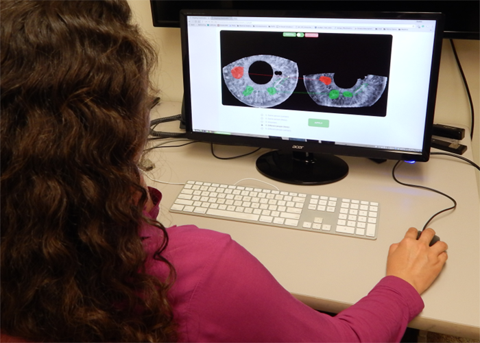
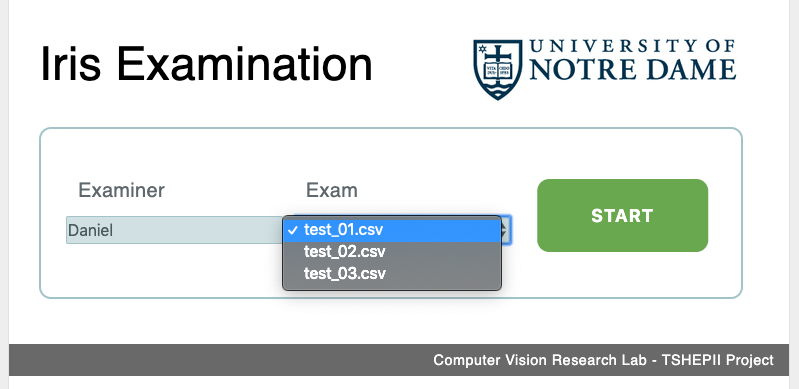
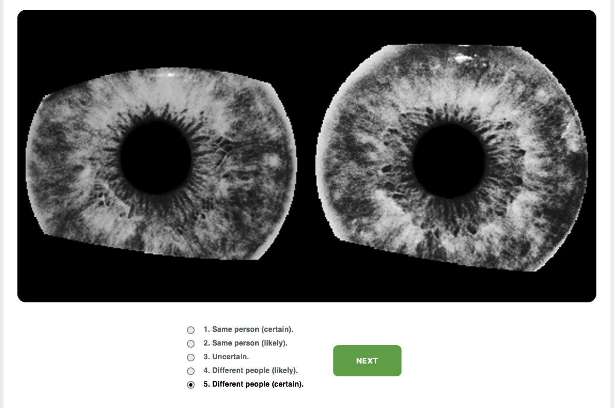
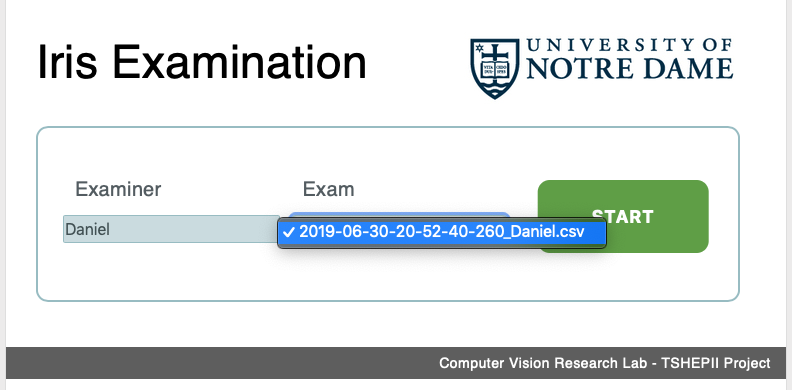
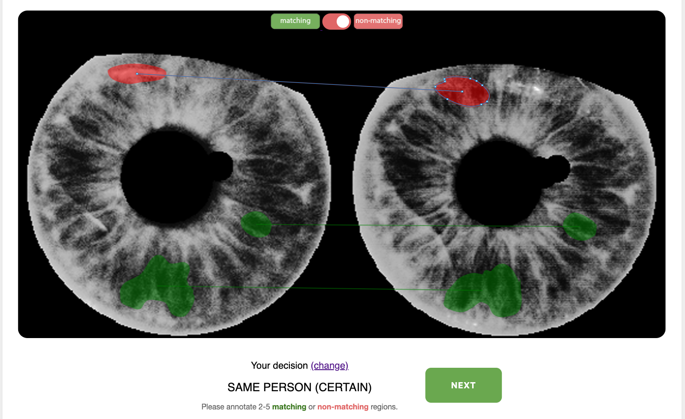

# Iris Examination
Web system that allows people to compare and annotate pairs of iris images.
The main system objective is to support **iris recognition**.

## Deployment
The system source code shall be copied to an [Apache](https://httpd.apache.org/) server whose [PHP](https://php.net/) module is activated.
We recommend creating a folder named *iris-examination* within the server root web folder to contain the entire code.
As a consequence, the system will be available at *http://**your-server**/iris-examination*.
Visit *http://**your-server**/iris-examination/test.php* within your web browser to verify if the system is working correctly.
A successful deployment shall depict basic PHP info.

## System Usage Pipeline
The system usage comprises two steps: [*(1) Opinion Selection*](#opinion-selection) and [*(2) Manual Annotation*.](#manual-annotation)

### Opinion Selection
The first step of the system usage pipeline shall be available at *http://**your-server**/iris-annotation/step1/*.
After providing their name, the user must select one *examination script*, which will control the flow of the iris examination activity.

Examination scripts are CSV files that must be stored within the [*exams*](./exams) folder.
They must present the same headers as the given test examples: [*test_01*](./exams/test_01.csv), [*test_02*](./exams/test_02.csv), and [*test_03*](./exams/test_03.csv).
Each line of an examination script refers to an iris image pair within the [*irises*](./irises) folder, whose examination must be performed by the user.
Examination scripts might have as many lines (and therefore as many image pairs) as desired.
Here, we highlight that, in every access, the system shuffles the lines of an examination script before presenting their respective iris image pairs to the user.
The user's opinions are stored in CVS format within the [*results*](./results) folder.

We encourage users to provide their own iris image pairs (which must be copied to the [*irises*](./irises) folder), as well as their own examination scripts (which must be copied to the [*exams*](./exams) folder), in the occasion of using the system.

### Manual Annotation  
The second step of the system usage pipeline shall be available at *http://**your-server**/iris-annotation/step2/*.
After providing their name, the user must select one of various *result sets* previously obtained in [step 1](#opinion-selection), which had been stored in the the [*results*](./results) folder.

Once a set of results is selected, the system allows the user to manually annotate and link *matching* (in green) and *non-matching* (in red) texture regions shared by a pair of irises.
For each iris pair, the user can draw and erase as many annotations as they want.
The user's annotations are stored in JSON format within the [*annotations*](./annotations) folder.

Alternatively, the user can change the opinion previously provided in step 1, by clicking on the *change* link, in the bottom of the page; it will unlock the feature of opinion selection.

## Acknowledgments
This system was developed in the Computer Vision and Research Lab ([CVRL](https://cvrl.nd.edu/)) at the University of Notre Dame.
It is part of the [TSHEPII](https://danielmoreira.github.io/project/tshepii/) project, under the invaluable supervision of Dr. [Adam Czajka.](https://engineering.nd.edu/profiles/aczajka)
CSS files were coded by [Priscila Saboia](https://github.com/psaboia), who implemented the system style from mere *Google Slides* [sketches](https://docs.google.com/presentation/d/1yW5ovo12eH2bKdYGmbRg3O7Uk88_iMsLL-Ii7T7D0os/edit?usp=sharing). 
Oliveira's [project](https://www.codeproject.com/Articles/801111/Html-Image-Markup) was the starting point to develop the annotation feature.
Thank you all! 

## References
* [Paper.js](http://paperjs.org/), version 0.9.18   
HTML5 vector graphics scripting framework

* [JQuery](https://jquery.org/), version 1.9.1   
JavaScript library and API

* [HTML5 Image Markup](https://www.codeproject.com/Articles/801111/Html-Image-Markup), by Marcelo de Oliveira   
Sample project that shows how to use Paper.js